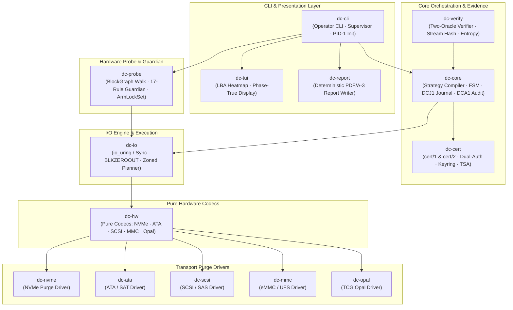
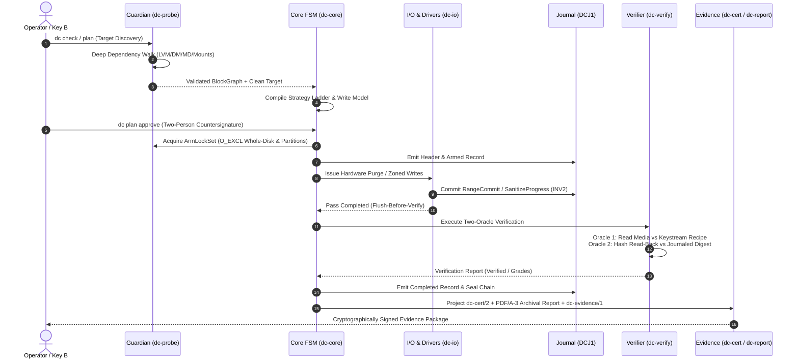
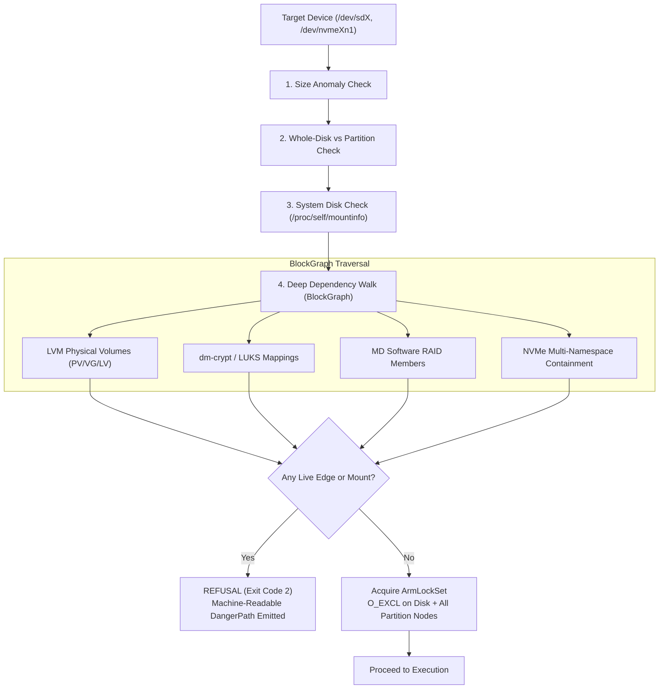
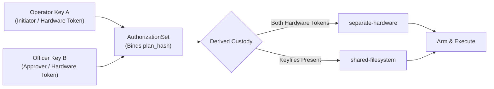
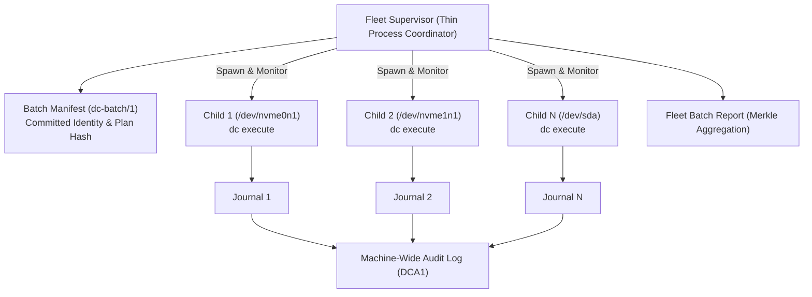

# diskCleaner (`dc`)

[](https://github.com/zephyr4289/diskCleaner)
[](LICENSE)
[](https://github.com/zephyr4289/diskCleaner)
[](docs/diskCleaner.md)
[](https://github.com/zephyr4289/diskCleaner)

**Forensic-grade storage sanitization for Linux — every claim carries its own evidence, verification instructions, and cryptographic proof.**

`dc` is a self-contained, statically linked, zero-dependency storage sanitization suite engineered for NVMe, SATA, SAS/SCSI, USB-bridged (SAT), eMMC/UFS, TCG Opal self-encrypting (SED), and Host-Managed SMR/ZNS storage. It executes **NIST SP 800-88 Rev 1** Clear and Purge operations, issuing cryptographically signed, third-party-verifiable evidence packages that survive crashes, power loss, and adversarial cross-examination.

```
Version       : v0.3.1 (Complete Product Release)
Target Triples: x86_64-unknown-linux-musl · aarch64-unknown-linux-musl
Runtime Deps  : Zero external binaries, zero dynamic libraries
Crates        : 15 modular workspace crates (22,600+ Rust LOC)
Verification  : Ed25519 + RFC 8785 JCS + RFC 3161 TSA + PDF/A-3 Archival Embedding
```

---

## Table of Contents

- [Architectural Overview](#architectural-overview)
- [Data Flow & Lifecycle Model](#data-flow--lifecycle-model)
- [Device Support & Sanitization Matrix](#device-support--sanitization-matrix)
- [Quick Start](#quick-start)
- [The Guardian Safety System](#the-guardian-safety-system)
- [Cryptographic Evidence & Offline Verification](#cryptographic-evidence--offline-verification)
- [Two-Person Integrity & Key Lifecycle](#two-person-integrity--key-lifecycle)
- [Fleet Orchestration](#fleet-orchestration)
- [Standalone Boot Environment](#standalone-boot-environment)
- [Engineering Discipline & Testkit](#engineering-discipline--testkit)
- [Standards & Compliance](#standards--compliance)

---

## Architectural Overview

`diskCleaner` is organized into 15 modular Rust crates with strict unidirectional dependency boundaries. Unsafe code is strictly isolated to low-level ioctl wrappers; all protocol codecs, parsers, and strategy planners are pure, memory-safe, and deterministic.



---

## Data Flow & Lifecycle Model

Every sanitization run transitions through a deterministic, crash-resilient lifecycle. Execution state is committed to a hash-chained binary journal (`DCJ1`) before issuing media writes.



---

## Device Support & Sanitization Matrix

| Device Class | Primary Firmware Purge | Secondary Fallback | Clear Overwrite | NIST SP 800-88 Grade |
| :--- | :--- | :--- | :--- | :--- |
| **NVMe SSD** | Sanitize Crypto Erase / Block Erase | Format NVM (CES / SES) | `ChaCha20WindowV1` / Zero | **Purge** / Clear |
| **SATA SSD** | ATA Sanitize Crypto Scramble | Enhanced Security Erase | `ChaCha20WindowV1` / Zero | **Purge** / Clear |
| **SATA HDD** | Enhanced Security Erase (DCO/HPA restored) | Security Erase | Multi-Pass DoD / Overwrite | **Purge** / Clear |
| **SAS / SCSI** | SCSI SANITIZE (Crypto / Block) | FORMAT UNIT (Format-Grade) | `ChaCha20WindowV1` / Zero | **Purge** / Clear |
| **USB-Bridged** | SAT Pass-Through (Runtime Probed) | Capability-Probed Overwrite | Verified Logical Overwrite | **Purge** / Clear |
| **eMMC / UFS** | Native Sanitize / Secure Purge | Secure Trim / Trim Erase | User Area Overwrite (RPMB Gated)| **Purge** / Clear |
| **Locked SED** | TCG Opal 2.0 PSID Crypt-Revert | Factory Revert | N/A (PSID unlocks unreadable media)| **Purge** |
| **SMR / ZNS** | Zoned Sequential Discipline + Resets | Zone-Attested Coverage | Sequential Stream Overwrite | **Purge** / Clear |

---

## Quick Start

### 1. Build the Static Binary
```bash
# Clean musl static build (no dynamic dependencies)
cargo build --release --target x86_64-unknown-linux-musl
```

### 2. Reconnaissance & Safety Audit
```bash
# List all system block devices with advisory classification
dc list

# Check target safety against the 17-precedence Guardian (Read-Only)
dc check --target /dev/nvme0n1
```

### 3. Strategy Compilation
```bash
# Compile a deterministic sanitization plan committed by plan_hash
dc plan --target /dev/nvme0n1 --strategy purge --out plan.json
```

### 4. Two-Person Approval & Execution
```bash
# Second operator countersigns the plan (Pre-Arm Dual-Auth)
dc plan approve --plan plan.json --key /path/to/officer.key --out plan.approved.json

# Execute with operator key and interactive serial confirmation
dc execute --plan plan.approved.json --key /path/to/operator.key
```

### 5. Crash Recovery & Resumption
```bash
# Resume an interrupted wipe across crashes, power loss, or reboots
dc resume --journal /var/log/dc/run.dcj
```

### 6. Evidence Inspection & Verification
```bash
# Offline verification of signed certificate and journal chain
dc cert verify cert.json --journal run.dcj

# Generate deterministic archival PDF/A-3 report with embedded JSON
dc report --cert cert.json --out report.pdf
```

---

## The Guardian Safety System

The Guardian enforces a mathematical guarantee: **no target will be modified if it contains live system dependencies or ambiguous identity.**



---

## Cryptographic Evidence & Offline Verification

All evidence emitted by `diskCleaner` is **independently verifiable without using `dc`**:

1. **RFC 8785 Canonical JSON (JCS):** All certificates (`dc-cert/1` and `dc-cert/2`) are canonicalized under RFC 8785 to ensure identical hashing regardless of whitespace or key ordering.
2. **Ed25519 Signatures (RFC 8032):** Digital signatures can be checked with any standard OpenSSL command:
   ```bash
   openssl dgst -sha512 -verify pubkey.pem -signature cert.sig canonical_cert.json
   ```
3. **Deterministic Keystream Recipe (`ChaCha20WindowV1`):** Every random pass derives its stream via `ChaCha20(key = seed, nonce = window_index)`. Third parties can regenerate and verify any sector of a 20 TB drive with $O(1)$ memory overhead.
4. **RFC 3161 TSA Timestamp Anchors:** Anchors provide verifiable proof that evidence existed *at-or-before* time $T$.
5. **PDF/A-3 Archival Embedding:** Reports embed the raw signed JSON, token sidecars, and keyring references directly inside the PDF document attachments.

---

## Two-Person Integrity & Key Lifecycle



* **Pre-Arm Gating:** Single-operator execution is strictly refused with `AUTHORIZATION_INCOMPLETE` when policy requires dual integrity.
* **Bilateral Key Rotation:** `dc-keyring/1` links old key supersession and new key activation at identical timestamp $T$.
* **At-or-After Revocation:** Revoked keys preserve historical pre-revocation evidence while marking post-revocation signatures as `SUSPECT_REVOKED_KEY`.

---

## Fleet Orchestration

The fleet supervisor orchestrates multi-drive bulk sanitization using a **process-per-device** isolation model.



* **Supervisor Ignorance Law:** The supervisor knows processes, pipes, and signals, but carries zero device-specific driver code.
* **Independent Child Drains:** Children handle signals locally and drain in-flight writes to disk independently ($P == C$).
* **Seam Verification:** The supervisor asserts that `constructed_argv_hash == child_journal_argv_hash`.

---

## Standalone Boot Environment

`diskCleaner` ships a self-contained bare-metal boot ISO:
* **PID-1 Architecture:** `dc` boots directly as `/init` with no shell (`/bin/sh`), no initramfs scripts, and zero daemon dependencies.
* **Self-Protection:** The boot medium (`BOOT_MEDIUM`) and active evidence sink (`EVIDENCE_SINK`) are protected by non-overridable Guardian rows.
* **Persistent Evidence Sink:** Probes and verifies evidence sinks before arming any destructive operation.
* **Hardware Unfreeze:** Executes RTC/S3 suspend dances to clear SATA BIOS freeze locks safely.

---

## Engineering Discipline & Testkit

The system is tested against an exhaustive verification lattice:
* **23 Red-Team Test Rigs (T1–T23):** Covering fault injection, crash recovery, Guardian trees, PRNG cleanroom, Opal SEDs, USB bridges, and Zoned SMR.
* **16 Founding Ceremonies:** Minting immutable golden vectors, certificates, and test corpora with documented provenance.
* **3 CI Lanes:** Pure (unprivileged mock suite), Root (loopback, null_blk, and kernel devices), and Scheduled (bare-metal silicon menagerie).
* **Reproducibility Triangle:** Proves `{x86-env-1, x86-cross-2, arm-native}` produce 100% byte-identical release binaries.
* **Dual Implementations:** Every cryptographic verifier, parser, and journal oracle is independently implemented in `dc-testkit` to eliminate self-judging bias.

---

## Standards & Compliance

* **NIST SP 800-88 Rev 1:** Guidelines for Media Sanitization (Clear, Purge, and Destroy).
* **IEEE 2883-2022:** Standard for Sanitizing Storage.
* **DoD 5220.22-M:** National Industrial Security Program Operating Manual (Legacy multi-pass overwrite).
* **RFC 8785 (JCS):** JSON Canonicalization Scheme.
* **RFC 8032:** Edwards-Curve Digital Signature Algorithm (Ed25519).
* **RFC 3161:** Internet X.509 Public Key Infrastructure Time-Stamp Protocol.
* **ISO 19005-3 (PDF/A-3):** Archival Document Format with Embedded Verifiable Payloads.

---

## License

Licensed under either of:
* Apache License, Version 2.0 ([LICENSE-APACHE](LICENSE-APACHE) or http://www.apache.org/licenses/LICENSE-2.0)
* MIT License ([LICENSE-MIT](LICENSE-MIT) or http://opensource.org/licenses/MIT)

at your option.
