# diskCleaner — The Complete Engineering Reference

> **The definitive technical and evidentiary deposition for `diskCleaner` (`dc`) v0.3.1.**  
> This specification documents the complete 15-crate architecture, mathematical models, finite state machines, cryptographic invariants, and operational surfaces governing forensic-grade storage sanitization under **NIST SP 800-88 Rev 1**, **IEEE 2883-2022**, **RFC 8785 (JCS)**, **RFC 8032 (Ed25519)**, **RFC 3161 (TSA)**, and **ISO 19005-3 (PDF/A-3)**.

---

# Table of Contents

- [Phase 1: Foundations, Architecture & Operational Surface](#phase-1-foundations-architecture--operational-surface)
  - [1. Design Philosophy & Evidentiary Vocabulary](#1-design-philosophy--evidentiary-vocabulary)
  - [2. System Architecture & Layer Invariants](#2-system-architecture--layer-invariants)
  - [3. The Command Surface & Operational Verbs](#3-the-command-surface--operational-verbs)
  - [4. The Guardian Safety Engine & Lock Choreography](#4-the-guardian-safety-engine--lock-choreography)
- [Phase 2: Identity, Hardware Purge Mechanisms & Strategy Compiler](#phase-2-identity-hardware-purge-mechanisms--strategy-compiler)
- [Phase 3: High-Throughput IO, Cryptographic PRNG & Two-Oracle Verification](#phase-3-high-throughput-io-cryptographic-prng--two-oracle-verification)
- [Phase 4: Sealed Journals, Audit Chains & Digital Certificates](#phase-4-sealed-journals-audit-chains--digital-certificates)
- [Phase 5: Trust Anchors, Custody, Archival Reports & Fleet](#phase-5-trust-anchors-custody-archival-reports--fleet)
- [Phase 6: Bare-Metal Boot, TUI, Cross-Architecture & Final Project Ledger](#phase-6-bare-metal-boot-tui-cross-architecture--final-project-ledger)
- [24. Codebase Scale & Crate-by-Crate LOC Census](#24-codebase-scale--crate-by-crate-loc-census)

---

# Phase 1: Foundations, Architecture & Operational Surface

## 1. Design Philosophy & Evidentiary Vocabulary

### 1.1 The Prime Directive
`diskCleaner` is constructed upon a single uncompromising axiom:
$$\forall \text{ claim } c \in \text{Certificate}, \quad \exists \text{ verifiable evidence } E(c) \text{ such that } \text{Verify}(E(c)) \to \{\text{True}, \text{False}\}$$

Commercial sanitization utilities traditionally generate unprovable status reports stating `"SUCCESS"`. In legal, regulatory, and adversarial forensic environments, such statements constitute hearsay. `diskCleaner` enforces that **every claim carries its own raw telemetry, its own provenance grade, and its own algorithmic instructions for third-party cross-examination**.

### 1.2 The Evidentiary Taxonomy
Claims emitted in certificates, audit logs, and archival reports are classified into strict, non-promotable evidentiary grades:

| Evidentiary Grade | Mathematical / Physical Basis | Permissible Scope |
| :--- | :--- | :--- |
| `tool-verified` | Direct byte-level read-back verification executed by the host engine across the complete LBA address space. | Logical overwrite passes, post-purge verification read-backs. |
| `controller-attested` | Unmodified, raw binary log pages retrieved directly from the device controller via standardized Admin commands. | NVMe Sanitize Status (Log 0x81), ATA Security status words, SCSI Sense data. |
| `effect-verified` | Observable side-effects independently verified on the device interface (e.g., deterministic timing collapse, bus re-enumeration). | USB-bridge command passthrough validation, DCO/HPA native capacity unmasking. |
| `spec-inferred` | Cryptographic state inferred from standards-mandated hardware transitions where internal media is physically inaccessible. | TCG Opal Media Encryption Key (MEK) erasure following authenticated PSID revert. |
| `indicative` | Non-evidentiary operational observations suffixed with `~`. Never journaled into cryptographic chains; purely display-grade. | Real-time I/O throughput ($\text{KiB/s}$), instant queue depth, live thermal sensor polling. |

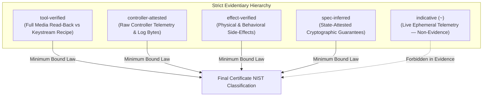

### 1.3 The Minimum Bound Law
Let $M = \{m_1, m_2, \dots, m_k\}$ be the set of executed sanitization mechanisms in a multi-step ladder. The aggregate NIST SP 800-88 sanitization classification $C(M)$ is defined by the weakest executed step:
$$C(M) = \min_{1 \le i \le k} \text{Grade}(m_i)$$
If a planned `Purge` operation falls back to a verified single-pass `Clear` overwrite, the resultant certificate is strictly titled and certified as **`Clear`**, eliminating title-block perjury.

---

## 2. System Architecture & Layer Invariants

### 2.1 Workspace Architecture
The system is partitioned into 15 focused crates with strict unidirectional dependency enforcement. Circular dependencies and cross-layer leaks are compile-time forbidden.

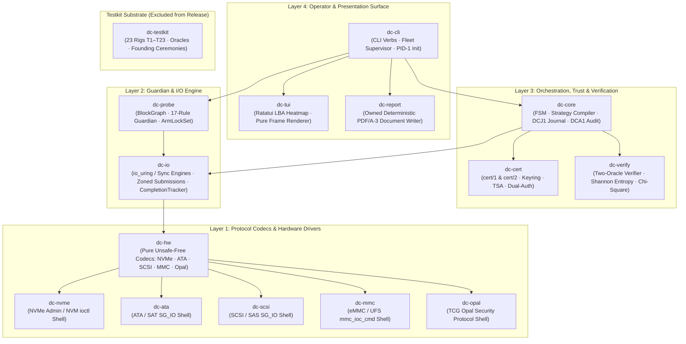

### 2.2 Formal System Invariants

```
┌──────────────────────────────────────────────────────────────────────────────────────────────────┐
│                                     FORMAL SYSTEM INVARIANTS                                     │
├──────────────────────────────────────────────────────────────────────────────────────────────────┤
│ INV1 (Write-Permit Typestate)                                                                    │
│   Destructive write calls require consuming an unforgeable `WritePermit` minted exclusively by   │
│   the Core FSM in `Executing` state upon consuming an active `ArmLockSet`.                       │
│                                                                                                  │
│ INV2 (Journal Lag Lead-Law)                                                                      │
│   The committed journal offset C never leads physical media position P:                          │
│   C ≤ P ≤ C + QD_depth + Checkpoint_Interval + 2                                                 │
│                                                                                                  │
│ INV3 (Deterministic PRNG Bijection)                                                              │
│   Sector content at LBA L under seed S is an invariant bijection:                                │
│   Byte(L) = ChaCha20(Key = S, Nonce = ⌊L / WindowSize⌋, Counter = (L mod WindowSize))            │
│                                                                                                  │
│ INV4 (Guardian Lock Isolation)                                                                   │
│   All destructive targets hold exclusive kernel claims (`O_EXCL` + `flock(LOCK_EX)`) across     │
│   both the whole-disk node and every child partition node for the duration of execution.         │
│                                                                                                  │
│ INV5 (Two-Oracle Independence)                                                                   │
│   Oracle 1 (Media vs Plan Recipe) and Oracle 2 (Readback vs Recorded Stream Hash) share zero     │
│   state and execute independent computational pipelines.                                         │
│                                                                                                  │
│ INV6 (No-Harm ATA Lifeline)                                                                      │
│   ATA Security passwords are generated as cryptographically secure random rescue keys,           │
│   journaled exclusively as SHA-256 digests, and structurally zeroized upon clean completion.     │
│                                                                                                  │
│ INV7 (Permanent ZONE APPEND Ban)                                                                 │
│   All writes to zoned storage (SMR/ZNS) utilize direct sequential WRITE commands to computed     │
│   pointers. `ZONE APPEND` is permanently forbidden to preserve recipe LBA bijections.            │
└──────────────────────────────────────────────────────────────────────────────────────────────────┘
```

---

## 3. The Command Surface & Operational Verbs

The CLI surface (`dc-cli`) exposes deterministic, non-interactive-capable subcommands. Stdin is consumed exclusively for interactive confirmations when attached to a TTY.

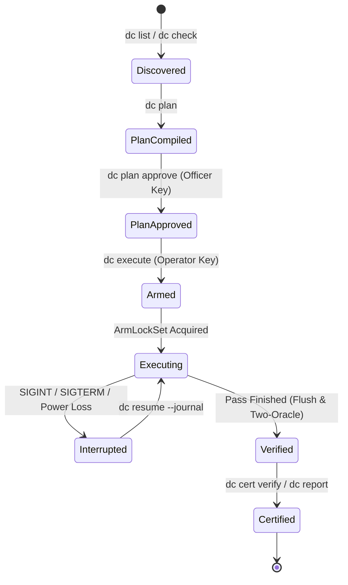

### 3.1 Comprehensive Subcommand Reference

```
Reconnaissance & Pre-Flight (Non-Mutating, Always Safe)
  dc list
      Enumerate system block devices, sysfs attributes, stable serials, and advisory classifications.
  dc check --target <DEV>
      Execute the full 17-precedence Guardian evaluation against a target device.
      Exit Codes: 0 (Clean to wipe) | 2 (Guardian refusal with DangerPath evidence).

Planning & Authorization
  dc plan --target <DEV> [--strategy purge|clear] [--profile <NAME>] [--seed <HEX32>] [--out <FILE>]
      Compile deterministic strategy ladder, write model, verification level, and plan_hash.
  dc plan approve --plan <FILE> --key <OFFICER_KEY> [--out <APPROVED_FILE>]
      Countersign a compiled plan using an independent officer key to satisfy pre-Arm dual-auth.

Execution & Lifecycle Management
  dc execute --plan <FILE> --key <OPERATOR_KEY> [--serial-confirm <STR>] [--allow-system-disk]
      Arm locks, open journal, and execute sanitization ladder.
  dc resume --journal <DCJ_FILE> [--fingerprint <FP>]
      Re-evaluate hardware state, adopt in-flight firmware sanitization, and resume execution.

Forensic Verification & Archival Projection
  dc verify --journal <DCJ_FILE>
      Execute two-oracle re-verification over physical media and journal records.
  dc verify --dir <PATH> | --package <PKG_FILE>
      Exhaustive batch verification across all certificates and evidence packages without early exit.
  dc cert show|verify|reconstruct <CERT_FILE>
      Display canonical certificate, verify cryptographic signatures, or reconstruct from journal.
  dc report --cert <CERT_FILE> [--out <PDF_FILE>]
      Project deterministic, archival-grade PDF/A-3 document with embedded signed JSON attachments.

Fleet & Key Operations
  dc fleet prepare|start|attach|resume|report --manifest <BATCH_FILE>
      Coordinate concurrent multi-drive batch sanitization across process-isolated children.
  dc key generate|rotate|revoke --key <KEY_FILE>
      Manage operator and officer Ed25519 signing keys within the dc-keyring/1 registry.
```

---

## 4. The Guardian Safety Engine & Lock Choreography

### 4.1 The 17-Precedence Guardian Table
Target classification is a **pure function of kernel facts, hardware state, and operator flags**. The Guardian evaluates rules in strict numerical precedence:

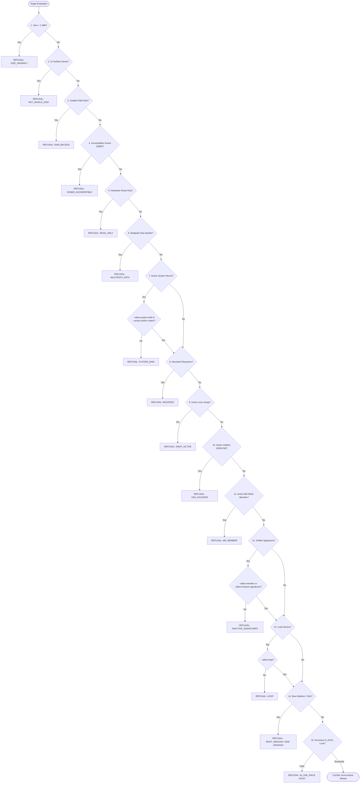

### 4.2 The Deep Dependency Walk (`BlockGraph`)
The Guardian builds a directed acyclic graph $G = (V, E)$ of kernel storage topology:
* **Vertices $V$:** Whole disks, partitions, device-mapper targets (`dm-crypt`, `linear`, `multipath`), LVM physical/logical volumes, MD-RAID arrays, and NVMe namespaces.
* **Edges $E$:** Directed containment and holder relationships $(u, v)$ where $v$ holds or consumes $u$.

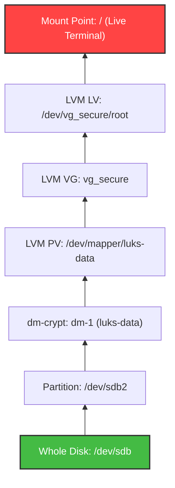

The traversal algorithm searches upward from the target disk $T \in V$:
$$\text{DangerPaths}(T) = \{ p = (T, v_1, v_2, \dots, v_k) \mid v_k \in \text{LiveTerminals} \}$$
If $\text{DangerPaths}(T) \ne \emptyset$, execution terminates immediately with exit code `2`, printing the exact chain of device dependencies (`DangerPath`).

### 4.3 Exclusive Lock Choreography (`ArmLockSet`)
To eliminate Time-of-Check to Time-of-Use (TOCTOU) races:
1. The whole-disk device node is opened with `O_RDWR | O_DIRECT | O_EXCL`. If any partition is mounted or held, the kernel returns `EBUSY`.
2. A non-blocking advisory lock `flock(fd, LOCK_EX | LOCK_NB)` is placed on the whole-disk descriptor.
3. Every child partition node (`/dev/sda1`, `/dev/sda2`, etc.) is opened with `O_RDWR | O_EXCL` and locked with `flock`. This prevents background daemons (e.g., `udisks2`, `systemd-gpt-auto-generator`) from mounting partitions mid-wipe.
4. If an `EBUSY` race occurs during arming, the Guardian performs exactly **one bounded re-classification** from fresh kernel facts to emit the exact race culprit before failing safely.
5. All file descriptors are encapsulated in RAII handles (`GuardianLockHandle`), ensuring locks are unlocked in reverse order on any exit, signal, or panic.

---

# Phase 2: Identity, Hardware Purge Mechanisms & Strategy Compiler

## 5. Two-Source Controller-Attested Identity & Confirmation Protocol

### 5.1 Dual-Source Identity Discovery
`diskCleaner` eliminates driver abstraction spoofing by querying hardware identity from two distinct, orthogonal channels:
1. **Host Kernel Channel (`sysfs`):** Read from `/sys/block/<DEV>/device/serial`, `/sys/block/<DEV>/device/wwid`, and `/sys/block/<DEV>/size`.
2. **Direct Controller Channel (Admin Passthrough):** Read directly via raw Admin commands — NVMe `Identify Controller` (Bytes 4–23 Serial, Bytes 24–63 Model) and `Identify Namespace` (NGUID, EUI64); ATA `IDENTIFY DEVICE` (Words 10–19 Serial, Words 27–46 Model, Words 108–111 WWN); SCSI `VPD Page 0x83` (Device Identification) and `VPD Page 0x80` (Unit Serial Number).

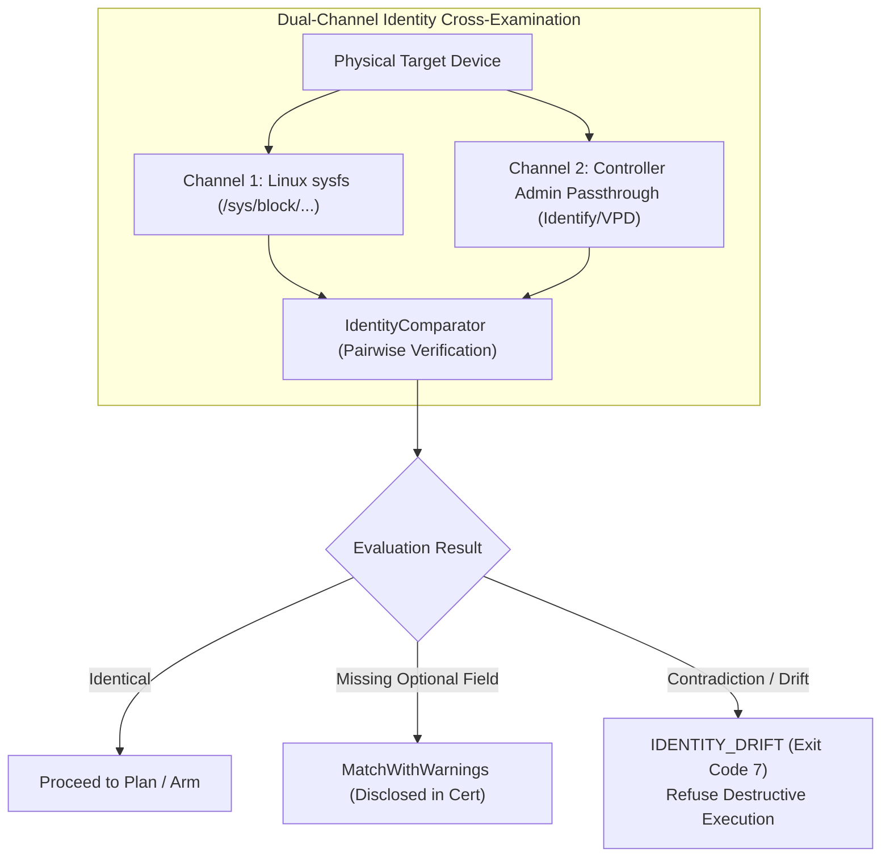

### 5.2 Confirmation Token Protocol
To eliminate accidental operator errors where `/dev/sdX` device nodes shift under dynamic `udev` events, the confirmation prompt renders identity **directly from the opened file descriptor** (blind to the plan's cached text). The operator must confirm by typing the exact hardware confirmation token derived by strict precedence:

$$\text{ConfirmationToken} = \begin{cases} 
\text{"nguid:"} \parallel \text{NGUID} & \text{if NGUID is present} \\
\text{"eui64:"} \parallel \text{EUI64} & \text{if EUI64 is present} \\
\text{Serial} \parallel \text{":n"} \parallel \text{NSID} & \text{if Multi-Namespace NVMe} \\
\text{Serial} & \text{if Serial Number is present} \\
\text{KernelName} & \text{otherwise (fallback)}
\end{cases}$$

### 5.3 The Seven-Point Identity Lifecycle
Identity invariants are verified continuously across seven distinct lifecycle checkpoints:

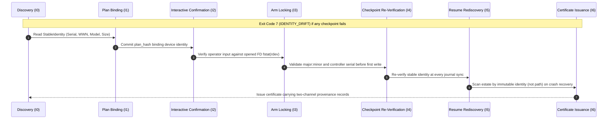

---

## 6. Sanitization Mechanisms & Strategy Compiler

### 6.1 The Strategy Matrix
The strategy compiler (`StrategyCompiler`) is a pure, deterministic translation engine that takes device transport class, attested hardware capabilities, and requested sanitization tier to produce an immutable, ordered `StrategyLadder`:

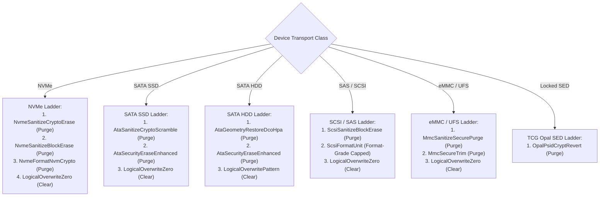

### 6.2 Mechanism Engineering Specifications

#### 1. NVMe Sanitize & Format NVM
* **Command Codes:** Sanitize Admin Opcode `0x84` (SANACT: `0x01` Exit Failure, `0x02` Block Erase, `0x04` Crypto Erase). Format NVM Admin Opcode `0x80`.
* **Telemetry Channel:** Polls Log Page `0x81` (Sanitize Status). Records Progress (`SPROG`, 0–65535, $0\% \to 100\%$) and Global Status (`SSTAT`).
* **Firmware Adoption Law:** If an asynchronous sanitize operation is executing upon host reboot or crash resumption, `dc` binds to the active firmware operation, polls it to natural completion, and embeds the raw controller log bytes into the final certificate.

#### 2. ATA Security Erase & No-Harm Rescue Lifeline
* **Command Set:** ATA Pass-Through via `SG_IO` (Opcode `0xA1` / `0x85`). Issue `SECURITY ERASE PREPARE` (`0xF3`) followed by `SECURITY ERASE UNIT` (`0xF4`).
* **No-Harm Lifeline Law ($\Delta330$):** To prevent bricking storage drives upon host crash during a locked erase state:
  $$\text{RescuePassword} \xleftarrow{\$} \{0, 1\}^{256}, \quad \text{LifelineHash} = \text{SHA-256}(\text{RescuePassword})$$
  The plain password is held exclusively in memory and committed to the encrypted journal. Certificates disclose only `LifelineHash`. Upon successful sanitization, the password is structurally zeroized. If an interrupted drive remains locked, `dc` provides a deterministic recovery utility using the journaled rescue key.
* **HPA / DCO Geometry Restoration:** Detects Hidden Protected Areas (HPA via `READ NATIVE MAX ADDRESS`) and Device Configuration Overlays (DCO via `DEVICE CONFIGURATION IDENTIFY`). Issues `DCO RESTORE` and `SET MAX ADDRESS` to expose hidden host sectors before executing overwrite passes.

#### 3. SCSI / SAS SANITIZE & FORMAT UNIT
* **Command Set:** `SANITIZE` (`0x48`) with Service Action `0x01` (Overwrite), `0x02` (Block Erase), or `0x03` (Crypto Erase).
* **Format-Grade Capping:** `FORMAT UNIT` (`0x04`) is classified as `Format-Grade` and capped below `Purge` on certificates, complying strictly with ANSI INCITS SBC-3 warnings that format commands do not guarantee physical cell de-allocation.

#### 4. eMMC / UFS Per-Partition Isolation
* **Partition Geometry:** Distinguishes User Data Area (UDA), Boot Partition 1 (`boot0`), Boot Partition 2 (`boot1`), General Purpose Partitions (`gp0`–`gp3`), and Replay Protected Memory Block (RPMB).
* **RPMB Disclosure Law:** Because RPMB partitions are hardware-authenticated with an unrecoverable write-once symmetric HMAC key, RPMB is formally classified and disclosed as `key-protected-inaccessible` on certificates, never fraudulently claimed as erased.

#### 5. TCG Opal 2.0 PSID Crypt-Revert
* **Protocol:** TCG Storage Core Specification & Opal SSC 2.0. Communicates via `SECURITY PROTOCOL IN` (`0xA2`) and `SECURITY PROTOCOL OUT` (`0xB5`) using Protocol ID `0x01` (Discovery) and `0x02` (Locking SP).
* **PSID Authentication:** Reverts Locking SP to factory state using the 32-character Physical Security ID (PSID) printed on the drive label.
* **MEK State Assertion:** Formally certifies media encryption key invalidation as `spec-inferred, state-attested`.

#### 6. USB / SAT Bridge Lie Detector & Verification Ceiling
USB-to-SATA/NVMe bridges frequently report fraudulent status or silently drop hardware commands. `dc` subjects bridge interfaces to an empirical test battery:

| Lie Class | Observable Symptom | Detection & Countermeasure |
| :--- | :--- | :--- |
| `ACCEPT_NOOP` | Bridge returns SCSI `GOOD (0x00)` without forwarding command to ATA drive. | Reads baseline test blocks before and after; asserts physical pattern modification. |
| `SILENT_DROP` | Firmware drop of ATA pass-through registers. | Verifies ATA return descriptor registers in `SG_IO` status buffer. |
| `WRONG_SENSE` | Invalid or generic Sense Keys returned on failure. | Compares SCSI Sense Key/ASC/ASCQ against standardized SAT-3 lookup tables. |
| `TIMEOUT_KILL` | Bridge controller resets and hangs USB bus during long firmware erases. | Watchdog heartbeat monitoring with automatic driver unbind/rebind choreography. |
| `MANGLE` | Bridge corrupts or byte-swaps LBA addresses during direct pass-through. | Issues read/write probes at boundary LBAs ($2^{32}-1$, native max) to confirm alignment. |
| `CAPACITY_MASK`| Bridge masks 48-bit LBA capacity, truncating 8 TB drives to 2 TB. | Compares ATA `IDENTIFY` Word 60/61 capacity against SCSI `READ CAPACITY (16)`. |

---

## 7. Write Models: `random-capable` & `zoned-sequential` (Host-Managed SMR/ZNS)

### 7.1 Orthogonal Strategy Compiler Axis
Strategy compilation operates along two independent, orthogonal axes:
$$\text{ExecutionStrategy} = \text{MechanismLadder}(\text{DeviceClass}) \times \text{WriteModel}(\text{ZoneReport})$$

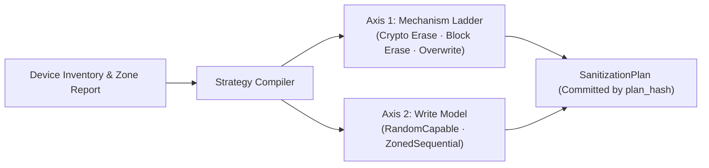

### 7.2 Zoned Storage Discipline & Permanent `ZONE APPEND` Ban
Host-Managed Shingled Magnetic Recording (HM-SMR) and Zoned Namespaces (NVMe ZNS) forbid arbitrary in-place overwrites. Writes must follow strict sequential write pointer ($W$) discipline:

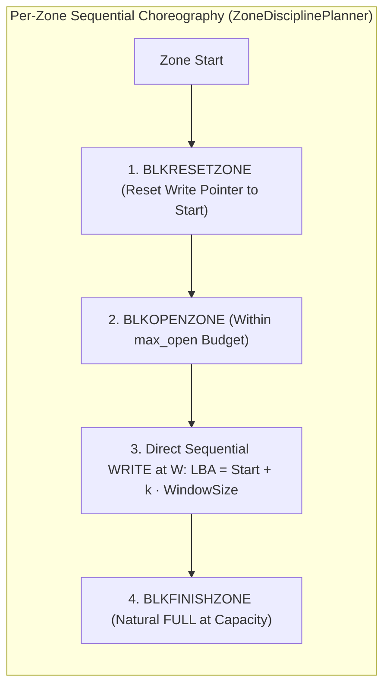

```
┌──────────────────────────────────────────────────────────────────────────────────────────────────┐
│                                   THE PERMANENT ZONE APPEND BAN                                  │
├──────────────────────────────────────────────────────────────────────────────────────────────────┤
│ NVMe ZNS provides a `ZONE APPEND` command allowing storage controllers to choose the target      │
│ LBA for incoming data. `diskCleaner` permanently bans `ZONE APPEND` from the sanitization path: │
│                                                                                                  │
│ 1. The fundamental reproducible recipe (A2) requires a strict mathematical bijection:            │
│    WindowIndex k ↔ Physical LBA L → ChaCha20 Keystream Nonce                                     │
│ 2. If the storage device picks LBA allocations dynamically, expected bytes at any address       │
│    become non-deterministic and unverifiable by third-party auditors.                            │
│ 3. `dc` strictly issues standard `WRITE` commands directed explicitly to computed pointers.     │
└──────────────────────────────────────────────────────────────────────────────────────────────────┘
```

### 7.3 Three Frontiers & Pass Ambiguity Resolution
On zoned storage, resume operations track **three distinct frontiers**:
1. **Journal Committed Frontier ($C$):** Recorded in `DCJ1` binary logs.
2. **Physical Media Frontier ($P$):** Verified by read scans.
3. **Hardware Write Pointer ($W$):** Reported directly by storage controller zone descriptors.

Hardware write pointers satisfy the invariant $C \le W$. However, a zone that is `FULL` at capacity after Pass 1 is physically indistinguishable in zone descriptors from a zone that is `FULL` after Pass 2. **`ZoneTransaction` journal records serve as the sole legal authority for pass attribution during crash resumption**, completely eliminating pass-attribution ambiguity.

### 7.4 Two-Witness Graded Certification & DM-SMR Timing Suspicion
* **Two-Witness Cert:** Upon completion of a zoned pass, the certificate embeds two complementary, adjacent proofs:
  1. `zone-attested-full-coverage` (Graded **`controller-attested`** for physical write coverage).
  2. `readback-verification-digest` (Graded **`tool-verified`** for cryptographic content truth).
* **Drive-Managed SMR (DM-SMR) Fingerprinting:** Drive-Managed SMR drives conceal zones behind a conventional interface (`zoned = none`), but suffer a 10x–20x throughput collapse on rewrite passes due to internal shingle track defragmentation. `dc` monitors multi-sweep performance ratios; if rewrite speed collapses below 20% of baseline, the certificate emits a **`suspected-managed-smr`** disclosure without falsely claiming absolute hardware detection.

---

# Phase 3: High-Throughput IO, Cryptographic PRNG & Two-Oracle Verification

## 8. The High-Throughput I/O Engine

### 8.1 Dual-Engine Architecture
`diskCleaner` abstracts kernel block I/O behind the unified `Engine` trait, selecting runtime implementations according to hardware and kernel support:
1. **`UringEngine` (Primary High-Throughput Path):** Leverages Linux `io_uring` with Submission Queue polling (`IORING_SETUP_SQPOLL`), direct buffer registration (`IORING_REGISTER_BUFFERS`), and kernel fixed files (`IORING_REGISTER_FILES`). Operates asynchronously with configurable queue depths ($\text{QD} = 64 \dots 256$).
2. **`SyncEngine` (POSIX Fallback Path):** Synchronous vector I/O using `pwritev2` / `preadv2` with `RWF_DSYNC` and `O_DIRECT`. Used in legacy, containerized, or restricted kernel environments where `io_uring` is disabled by seccomp filters.

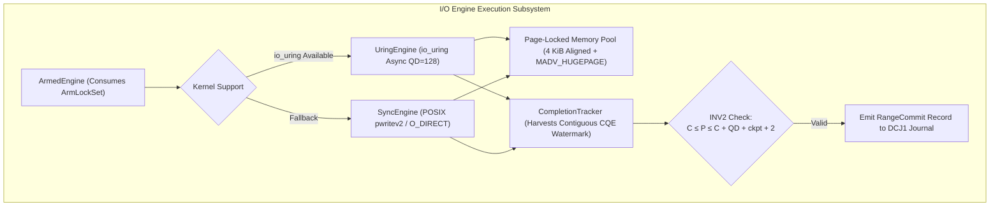

### 8.2 Pinned Memory Pooling & The One-Buffer Zero-Allocation Technique
* **Page Alignment:** All I/O buffers are 4096-byte page-aligned using `posix_memalign`, locked in physical RAM with `libc::mlock` to prevent swap paging, and tagged with `libc::MADV_HUGEPAGE` for TLB efficiency.
* **The One-Buffer Optimization:** For window-invariant passes (`ZeroPattern`, `FixedPattern`), `dc` allocates exactly **one immutable 2 MiB registered buffer** and aliases its memory across all 128 in-flight Submission Queue Entries (SQEs). This achieves line-rate physical bus saturation with near-zero host CPU memory bandwidth.
* **`BLKZEROOUT` Offloading:** For zero-fill passes on compliant controllers, `dc` issues `BLKZEROOUT` ioctls in 2 GiB chunks, commanding the storage firmware to unmap or zero LBAs without generating host PCIe/SATA bus write traffic.

### 8.3 The `CompletionTracker` & Invariant INV2 Lead-Law
Asynchronous queue submissions complete out-of-order. If a power outage occurs while write requests are pending, arbitrary uncommitted holes could exist on media.

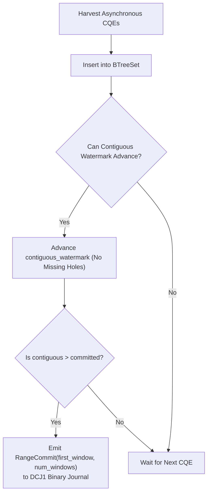

The `CompletionTracker` maintains an append-only watermark ensuring that **journaled progress strictly lags or equals physical media progress**:
$$C \le P \le C + \text{QD} + \text{CheckpointInterval} + 2$$
Where:
* $C$: Committed contiguous journal window offset.
* $P$: Physical disk write position.
* $\text{QD}$: In-flight asynchronous queue depth.

### 8.4 Flush-Before-Verify & Signal Interruption Drains
* **Mandatory Flush Boundary:** Upon completing a write pass, `dc` issues a mandatory hardware cache flush (`SYNCHRONIZE CACHE` / `NVMe Flush`). Verification read-back is strictly forbidden until the cache flush confirms durable non-volatile persistence.
* **Voluntary Signal Interruption ($P == C$):** When `SIGINT` (Ctrl+C), `SIGTERM`, or `SIGHUP` is received:
  1. The watcher thread cancels unsubmitted I/O and stops issuing new SQEs.
  2. Active in-flight writes complete their hardware cycles.
  3. The `CompletionTracker` harvests all remaining CQEs and commits the final contiguous range to `DCJ1`.
  4. The process exits with exit code `3` (`Interrupted`), leaving the media state in exact mathematical balance:
     $$P == C$$
  5. Resuming with `dc resume --journal <FILE>` continues cleanly from window $C + 1$ without redundant writes or missed gaps.

---

## 9. Deterministic Patterns & the Reproducibility Recipe (A2 Moat)

### 9.1 Pattern Families
`diskCleaner` supports three canonical pattern families:

| Pattern Family | Mathematical Construction | Verification Strategy |
| :--- | :--- | :--- |
| `Zero` | $B_i = 0x00, \quad \forall i$ | Strict 64-bit zero memcmp, $O(1)$ verification. |
| `Fixed{byte}` | $B_i = \text{byte}, \quad \forall i$ | Strict byte-matching memcmp. |
| `DeterministicRandom` | $\text{ChaCha20WindowV1}(\text{Seed}, \text{WindowIndex})$ | Keystream re-generation and online cryptographic comparison. |

### 9.2 The `ChaCha20WindowV1` Mathematical Specification
To guarantee that any third-party auditor, court expert, or opposing investigator can independently verify wiped storage using standard OpenSSL tools, the deterministic random pattern is strictly specified:

$$\text{Seed} \in \{0, 1\}^{256} \quad (\text{Committed in plan\_hash})$$
$$\text{Nonce}(w) = [w_0, w_1, w_2, w_3, w_4, w_5, w_6, w_7, 0x00, 0x00, 0x00, 0x00] \quad (12\text{-byte LE encoded window index } w)$$
$$\text{Keystream}(w) = \text{ChaCha20}_{\text{RFC8439}}(\text{Key} = \text{Seed}, \text{Nonce} = \text{Nonce}(w), \text{Counter} = 0)$$
$$\text{SectorBytes}(w, \text{offset}) = \text{Keystream}(w)[\text{offset} \dots \text{offset} + 512]$$

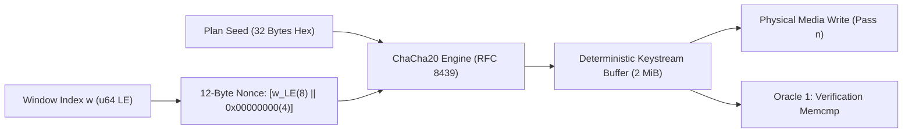

### 9.3 Standalone $O(1)$ Memory Verification Recipe
Because keystream generation is a direct mathematical function of window index $w$, an auditor can verify any arbitrary sector across a 20 TB storage array with **zero temporary disk storage and $O(1)$ host RAM** by embedding the documented recipe into standard verification scripts.

---

## 10. Two-Oracle Independent Verification, Readback Verdicts & Residual Scanner

### 10.1 Two-Oracle Independent Architecture
`diskCleaner` enforces structural separation between media verification and cryptographic consistency checking:

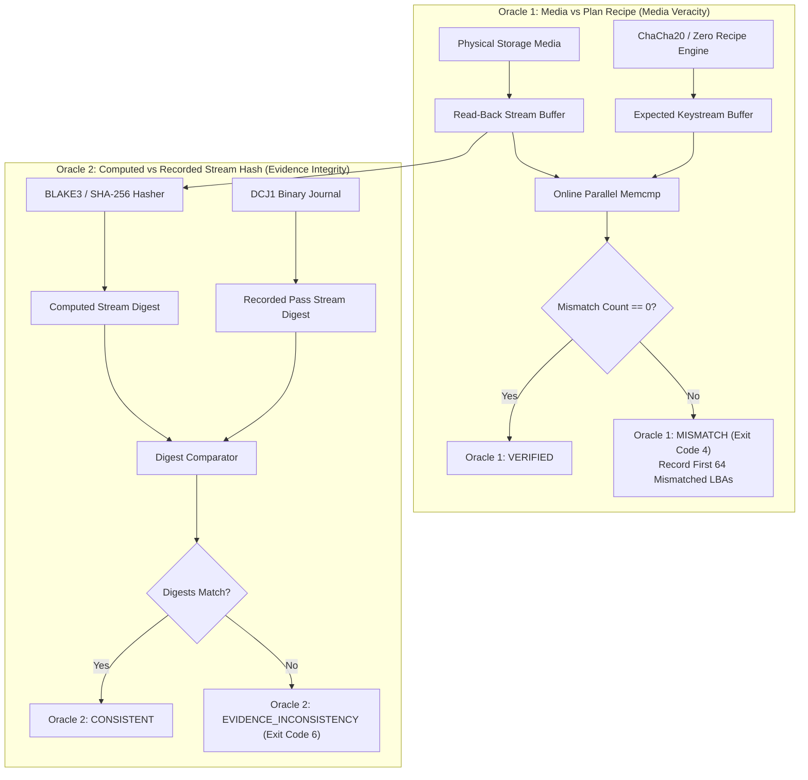

### 10.2 Three-Way Readback Verdicts
Every verification pass produces one of three legally binding verdicts:
1. **`verified`:** Read-back bytes match the exact expected mathematical pattern ($0$ mismatches across entire address space).
2. **`consistent-with-erased`:** Used following hardware cryptographic erase where NAND blocks return vendor-random or inverted bit patterns. Corroborated by zero recognizable data structures and high entropy.
3. **`failed`:** Surviving data detected. Triggers the Residual Signature Scanner to identify what survived and where.

### 10.3 Residual Signature Scanner & Stratified Sampling
When verification detects mismatches, the Residual Signature Scanner inspects suspect LBAs against a compiled database of magic headers:
* `LUKS1` / `LUKS2` partition headers (`0x4C554B53FA38`).
* `LVM2` Physical Volume labels (`LABELONE`, sector 1).
* `GPT` Partition Tables (`EFI PART`, LBA 1) and legacy `MBR` boot signatures (`0x55AA`, LBA 0).
* Filesystem Superblocks: `ext4` (`0xEF53`), `XFS` (`XFSB`), `Btrfs` (`_BHRfS_M`), `ZFS` vdev labels.
* Active/Stale `SWAPSPACE2` headers.

The scanner outputs exact LBA locations, byte offsets, and hex dumps of surviving signatures, providing undeniable evidence of incomplete sanitization.

### 10.4 Shannon Entropy $H(X)$ & Chi-Square $\chi^2$ Diagnostics
During verification read-back, `StreamVerifier` calculates online statistical entropy over the byte distribution $X$:

$$p(i) = \frac{\text{Count}(\text{byte } i)}{N}, \quad i \in [0, 255]$$
$$H(X) = -\sum_{i=0}^{255} p(i) \log_2 p(i) \quad (\text{Shannon Entropy in bits/byte})$$
$$\chi^2 = \sum_{i=0}^{255} \frac{(O_i - E_i)^2}{E_i}, \quad E_i = \frac{N}{256} \quad (\text{Uniformity Goodness-of-Fit})$$

* **Zero-Fill Passes:** Verified if $H(X) = 0.0000 \text{ bits/byte}$.
* **Random Cryptographic Passes:** Verified if $H(X) \approx 8.0000 \text{ bits/byte}$ and $\chi^2$ falls within the 95% uniform distribution confidence interval.
* **Diagnostic Presentation Rule ($\Delta461, \Delta465$):** Entropy metrics are rendered as neutral diagnostic figures and **never styled with green checkmarks or pass/fail verdicts**, maintaining strict epistemic honesty.

---

# Phase 4: Sealed Journals, Audit Chains & Digital Certificates

## 11. The Sealed Binary Journal (`DCJ1` v3.2)

### 11.1 Wire Format Specification
`DCJ1` is an append-only, binary-framed, hash-chained transaction journal engineered to withstand abrupt host power cuts:

```
┌──────────────────────────────────────────────────────────────────────────────────────────────────┐
│                                    DCJ1 BINARY WIRE FORMAT                                       │
├──────────────────────────────────────────────────────────────────────────────────────────────────┤
│ File Header:  [ b"DCJ1" (4 bytes magic) ]                                                        │
│                                                                                                  │
│ Record Structure (N >= 0):                                                                       │
│ ┌───────────────┬─────────────────────────────┬──────────────────────────────┬─────────────────┐ │
│ │ Length (u32LE)│ Record JSON Body (UTF-8)    │ Record Hash (BLAKE3 32B)     │ Sig (Ed25519 64)│ │
│ ├───────────────┼─────────────────────────────┼──────────────────────────────┼─────────────────┤ │
│ │ 4 Bytes       │ Variable (Len bytes)        │ 32 Bytes                     │ 64 Bytes (Seal) │ │
│ └───────────────┴─────────────────────────────┴──────────────────────────────┴─────────────────┘ │
└──────────────────────────────────────────────────────────────────────────────────────────────────┘
```

### 11.2 The Cryptographic Hash Chain
Every journal record binds to all prior history via iterative BLAKE3 hashing:
$$\text{Hash}_0 = \text{BLAKE3}(b\text{"DCJ1"})$$
$$\text{Hash}_i = \text{BLAKE3}(\text{RecordBytes}_i \parallel \text{Hash}_{i-1}), \quad \forall i \ge 1$$
If the journal is **Sealed** (`sealed = true`), an Ed25519 digital signature is appended per record:
$$\text{Sig}_i = \text{Ed25519}_{\text{Sign}}(\text{OperatorPrivateKey}, \text{RecordBytes}_i \parallel \text{Hash}_{i-1})$$


### 11.3 Multi-Epoch Transition Grammar (v3.2)
The journal enforces a formal transition automaton across host crashes and restarts:

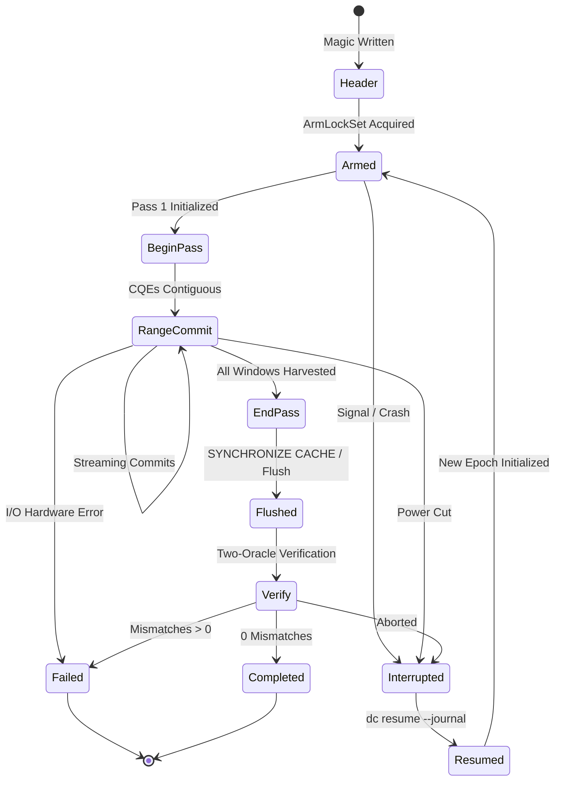

### 11.4 Torn Tails, Zero-Tail Signatures & `.tailsave` Preservation
1. **Torn Tails:** If a crash interrupts the final record write, `JournalReader` detects length/hash bounds truncation, truncates the file to the last valid cryptographic boundary, and copies the partial fragment into `<JOURNAL>.tailsave`.
2. **Zero-Tail Signature:** If trailing bytes consist purely of zeros ($0x00$), `dc` flags `JOURNAL_ZERO_TAIL` — the unmistakable physical forensic signature of host storage controller write buffering during a power cut.

### 11.5 Ten Independent Anti-Tamper Defense Layers

| Defense Layer | Mechanism & Mathematical Rule | Violation Catch |
| :--- | :--- | :--- |
| **1. Self-Hash** | Record body matches embedded BLAKE3 digest. | Bit-rot or single-byte modification. |
| **2. Hash Chain** | Record binds strictly to $\text{Hash}_{i-1}$. | Insertion, deletion, or reordering of records. |
| **3. Ed25519 Seal** | Signature over $(\text{Body} \parallel \text{Hash}_{i-1})$ using operator key. | Third-party record forgery or tampering. |
| **4. Transition Grammar**| Table-driven state automaton (Grammar v3.2). | Illegal out-of-order execution states. |
| **5. Monotonic Coverage**| Invariant: $\text{FirstWindow}_k = \sum \text{NumWindows}_{<k}$. | Coverage gaps, skipped LBAs, or overlapping ranges. |
| **6. Semantic Invariant**| Pass index $P \le \text{TotalPasses}$. | Fake pass creation or skipping passes. |
| **7. Device Binding** | Binds controller serial, NGUID, and capacity. | Replaying journal against a different drive. |
| **8. Verify Backstop** | Physical media readback required before `Completed`. | Declaring success without verifying media. |
| **9. Audit Reconciliation**| Journal UUID and chain head match machine `DCA1` log.| Unaudited rogue execution. |
| **10. Cert Cross-Check** | Certificate strictly projects from journal stream. | Fabricating unjournaled certificate claims. |

---

## 12. The Machine-Wide Audit Chain (`DCA1`)

### 12.1 Permanent System Memory
While journals are per-device and per-operation, `DCA1` (`/var/log/dc/audit-chain.log`) represents the machine-wide, immutable historical ledger. It is locked with `flock(LOCK_EX)` across all concurrent processes and formatted with file permissions `0700/0600`.

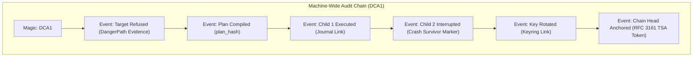

### 12.2 The Survivor Law
A crashed or killed process cannot write its own post-mortem record. `dc` enforces **The Survivor Law**:
1. When `dc resume` or `dc fleet resume` activates, the resumer inspects dangling `started` events.
2. The resumer writes a formal **Crash Marker** on behalf of the deceased process, committing the time of discovery and the last verifiable journal offset.
3. Unclaimed dangling jobs reconcile honestly as `unknown-termination`, ensuring zero history gaps.

### 12.3 RFC 3161 Chain-Head Anchoring
To prove that audit events were not generated retroactively:
$$\text{AuditAnchor} = \text{TSA}_{\text{RFC3161}}(\text{ChainHeadHash}_T)$$
Anchoring the chain head at timestamp $T$ cryptographically fixes the entire historical sequence at-or-before $T$.

---

## 13. Digital Certificates (`dc-cert/1` & `dc-cert/2`) & The Pure Projection Law

### 13.1 Strict Dual-Schema System
`diskCleaner` defines two strict schemas with zero tolerance for unknown fields:
* **`diskcleaner-cert/1`:** The foundational schema for pure logical overwrite passes. Supported for backwards compatibility across all future binaries.
* **`diskcleaner-cert/2`:** The hardware edition, embedding:
  * Minimum-derived NIST SP 800-88 status (`Purge` vs `Clear`).
  * Per-component verification grades (`tool-verified`, `controller-attested`, `spec-inferred`).
  * Three-capacity geometry (Current, Native, DCO-Max).
  * Controller log page dumps (NVMe Log 0x81, ATA Return Descriptors).
  * Host environment provenance (Bare-Metal Boot ISO vs Host OS).

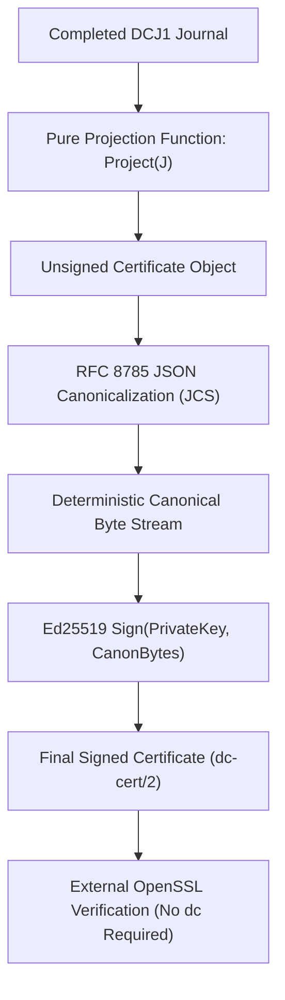

### 13.2 The Pure Projection Law
A certificate is **strictly a pure deterministic projection of a valid, Completed `DCJ1` journal**:
$$\text{Certificate} = \text{Project}(\text{CompletedJournal})$$
Generation and reconstruction call the exact same projection engine. Given a completed journal file, `dc cert reconstruct <JOURNAL>` generates the **byte-identical certificate**, matching the original cryptographic signature down to the last byte.

### 13.3 RFC 8785 Canonicalization (JCS) & RFC 8032 Determinism
To prevent signature invalidation caused by JSON formatting variations, whitespace, or object key reordering:
1. Payloads are canonicalized strictly according to **RFC 8785 (JSON Canonicalization Scheme)**.
2. Signatures are computed using **RFC 8032 (Ed25519)**, which uses deterministic nonce derivation ($r = \text{SHA-512}(h_b \parallel M)$), eliminating random-number-generator bias and ensuring signature repeatability.

### 13.4 Independent Verification via OpenSSL
Third-party verifiers can authenticate `dc` certificates without installing `dc`:
```bash
# 1. Extract canonical payload (stripping the "signature" field)
jq 'del(.signature)' cert.json | jcs-canonicalize > canonical_payload.json

# 2. Extract public key and base64 signature
jq -r '.operator.public_key_ed25519' cert.json | xxd -r -p > pubkey.raw
jq -r '.signature.value' cert.json | base64 -d > cert.sig

# 3. Verify digital signature using standard OpenSSL
openssl dgst -sha512 -verify pubkey.pem -signature cert.sig canonical_payload.json
```

---

# Phase 5: Trust Anchors, Custody, Archival Reports & Fleet

## 14. Trust Anchors (RFC 3161 TSA & Hardware Security Modules)

### 14.1 Consent-Gated RFC 3161 Time-Stamping
Network connectivity in `diskCleaner` is strictly opt-in and restricted exclusively to explicit timestamping verbs (`dc evidence timestamp`):
* **No Atmospheric Network Access:** Operational wipe paths (`plan`, `execute`, `resume`, `verify`) are physically isolated from networking.
* **Offline Verification Forever:** Time-Stamp Tokens (`TST`) conform to **RFC 3161** and embed their complete X.509 certificate chains. `dc` ships a vendored root trust bundle with historical validity windows, allowing 10-year-old tokens to verify offline without active OCSP/CRL network connections.
* **Evidentiary Assertion:** Tokens prove that data existed **at-or-before time $T \pm \Delta t$**, never claiming unprovable "created exactly at" time semantics.


### 14.2 PKCS#11 Hardware Security Modules (HSMs) & YubiKeys
When signing certificates via hardware tokens:
* **Ed25519-Only Determinism:** Hardware signing is strictly limited to Ed25519 keys (`CKM_EDDSA`). ECDSA algorithms are explicitly banned and refused with a named reason, as non-deterministic nonce generation violates the Pure Projection Law.
* **Secret Hygiene:** PINs and passphrases are acquired via direct terminal prompts or protected file descriptors, locked with `libc::mlock`, zeroized on drop, and excluded from memory core dumps via `MADV_DONTDUMP`.

---

## 15. Keyring Registry (`dc-keyring/1`) & Two-Person Integrity (2PI)

### 15.1 The Keyring Registry Schema (`dc-keyring/1`)
Operator and security officer public keys are managed in an immutable, append-only registry (`/var/lib/dc/keyring.json`):

```json
{
  "schema": "dc-keyring/1",
  "entries": [
    {
      "key_hash": "e3b0c44298fc1c149afbf4c8996fb92427ae41e4649b934ca495991b7852b855",
      "identity": "officer-alice@agency.gov",
      "role": "SecurityOfficer",
      "active_from_utc": 1787800000,
      "superseded_at_utc": null,
      "revoked_at_utc": null
    }
  ]
}
```

### 15.2 Bilateral Rotation & At-or-After Revocation Semantics
Key lifecycle transitions follow strict temporal validity logic:

$$\text{ValidAtTime}(K, T) = \begin{cases} 
\text{"SUSPECT\_REVOKED\_KEY"} & \text{if } T \ge T_{\text{revoked}} \\
\text{"VALID\_AT\_TIME"} & \text{if } T \ge T_{\text{active}} \land T < T_{\text{revoked}} \land (T_{\text{superseded}} = \emptyset \lor T < T_{\text{superseded}}) \\
\text{"SIGNATURE\_PRIOR\_TO\_KEY\_ACTIVATION"} & \text{if } T < T_{\text{active}}
\end{cases}$$

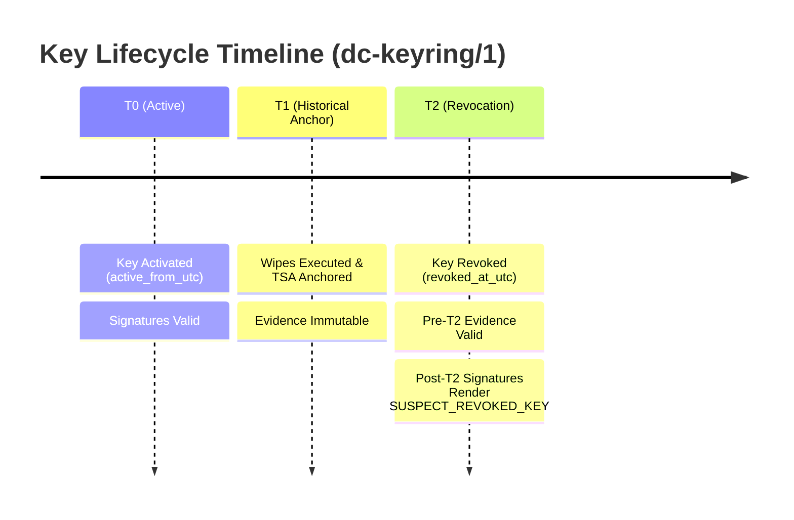

### 15.3 Pre-Arm Two-Person Integrity & Derived Custody
For high-assurance deployments, `diskCleaner` enforces Two-Person Integrity (2PI):
1. **Pre-Arm Gating:** `dc plan approve` generates an `AuthorizationSet` countersigned by an independent officer key binding the exact `plan_hash`. Execution refuses (`AUTHORIZATION_INCOMPLETE`) if the authorization set is missing or incomplete.
2. **Derived Custody Determination ($\Delta455$):** Custody grade is automatically derived from the physical nature of the signing credentials:
   $$\text{CustodyGrade} = \begin{cases} 
   \text{"separate-hardware"} & \text{if } \ge 2 \text{ distinct PKCS\#11 hardware tokens are used} \\
   \text{"shared-filesystem"} & \text{if any software keyfile is present on the host}
   \end{cases}$$

---

## 16. Evidence Packages (`dc-evidence/1`) & Archival Reports (PDF/A-3)

### 16.1 Evidence Package Container (`dc-evidence/1`)
All artifacts associated with a single job or fleet batch are assembled into a self-contained, cryptographically bound evidence container:

```
job-S6B0NJ0W102938X/
├── manifest.json       # dc-evidence/1 signed container manifest (Merkle root over files)
├── certificate.json    # Canonical dc-cert/2 certificate
├── certificate.pdf     # Deterministic archival PDF/A-3 report
├── journal.dcj         # Complete raw binary DCJ1 journal
├── journal.tailsave    # Preserved torn fragments (if crash recovered)
├── timestamp.tst       # RFC 3161 TimeStampToken from external TSA
└── keyring.json        # Snapshot of dc-keyring/1 registry at execution time
```

### 16.2 Owned Deterministic PDF/A-3 Generation (ISO 19005-3)
`diskCleaner` includes an **owned, zero-dependency PDF/A-3 generation engine** (`dc-report`) that avoids dynamic PDF libraries:
* **Zero Clock Leaks:** Dates and timestamps are derived strictly from the underlying evidence journal, never polling the host OS clock.
* **Single Vendored Monospace Font:** Hex-escaped Type 1 fonts ensure exact, identical text geometry across all host targets.
* **Deterministic Byte Streams:** Two builds of the report for the same certificate produce the **100% byte-identical PDF file**.

```mermaid
graph TD
    Cert["Signed Certificate (dc-cert/2)"] --> RepModel["ReportModel (Pure Layout Engine)"]
    RepModel --> TitleRule{"Outcome == Clean?"}
    TitleRule -- Yes --> CleanTitle["Title: CERTIFICATE OF DATA SANITIZATION"]
    TitleRule -- No --> FailTitle["Title: SANITIZATION FAILURE AND AUDIT REPORT"]
    
    CleanTitle --> PDF["Owned PDF/A-3 Writer (ISO 19005-3)"]
    FailTitle --> PDF
    
    Cert --> Embed["Raw Canonical cert.json (application/json)"]
    Embed --> PDF
    PDF --> FinalPDF["Archival PDF/A-3 Document (Embedded Authoritative Record)"]
```

### 16.3 The Embedded Evidence Principle
Every generated page carries the legal disclaimer:
> *"This document is a rendering. The authoritative record is embedded within and governs over this text."*

Any standard extraction utility (`pdfdetach -savefile cert.json report.pdf` or standard unzip tools) can extract the original signed `cert.json` directly from the PDF catalog streams.

---

## 17. Fleet Orchestration & The Thin Supervisor Law

### 17.1 Process-per-Device Isolation
`diskCleaner` orchestrates multi-drive bulk sanitization across storage arrays using a **process-per-device supervisor model**:

```mermaid
graph TD
    Op["Operator"] -->|dc fleet start --manifest batch.json| Sup["Fleet Supervisor (Thin Conductor)"]
    Sup -->|Spawn Child 1| C1["dc execute --plan p1.json (/dev/nvme0n1)"]
    Sup -->|Spawn Child 2| C2["dc execute --plan p2.json (/dev/nvme1n1)"]
    Sup -->|Spawn Child N| CN["dc execute --plan pn.json (/dev/sda)"]

    C1 --> J1["Journal 1"]
    C2 --> J2["Journal 2"]
    CN --> JN["Journal N"]

    J1 --> SupReport["Fleet Batch Report (Merkle Aggregation)"]
    J2 --> SupReport
    JN --> SupReport
```

* **The Thin Supervisor Law:** The supervisor contains **zero storage driver, ioctl, or SCSI/NVMe protocol code**. It is strictly a pure process coordinator managing child processes, FIFOs, signals, and budget reservations.
* **Autonomous Child Survival:** If the supervisor is killed (`kill -9`), children continue executing independently, harvest completions, flush hardware caches, and commit their journals. Resuming with `dc fleet resume` reconstitutes the exact state from child journals.

### 17.2 The `dc-batch/1` Merkle Manifest & Argv Seam Verification
Batch operations are bound by an immutable manifest (`dc-batch/1`):
* **Identity-First Addressing:** Manifest rows bind controller-attested serial numbers and NGUIDs, never volatile `/dev/sdX` paths.
* **Argv Seam Verification:** The supervisor computes the child process CLI invocation and asserts that:
  $$\text{ConstructedArgvHash} == \text{ChildJournalArgvHash}$$
  Proving that the child executed the exact instructions intended by the batch manifest.

### 17.3 Worst-Case Child Severity Law
The aggregate exit code of a fleet run is governed by the worst child termination code:
$$\text{FleetExitCode} = \max_{1 \le i \le N} \text{Severity}(\text{Child}_i)$$
If 15 drives succeed (Exit 0) and 1 drive fails verification (Exit 4), the fleet command exits with **Exit Code 4**, preventing silent failures in bulk data center wiping operations.

---

# Phase 6: Bare-Metal Boot, TUI, Cross-Architecture & Final Project Ledger

## 18. The Bare-Metal Boot Environment (Release ISO)

### 18.1 PID-1 Direct Boot Architecture
The release ISO image boots `diskCleaner` directly as `/init` (PID 1) in a minimalist, hardened environment:
* **Zero Shell / Zero Daemon Footprint:** Contains no `/bin/sh`, no busybox, no udevd, and no network daemons.
* **Init Sequence:** Mounts `/proc`, `/sys`, and `/dev` devtmpfs; validates entropy readiness (`getrandom`); probes block device topology; and spawns either the interactive TUI dashboard or executes non-interactive command lines passed via kernel boot parameters (`dc.cmd=`).

```mermaid
graph TD
    subgraph "Bare-Metal Boot ISO Architecture"
        Kernel["Linux Kernel (Monolithic Built-In Drivers)"] --> Init["/init: dc (PID 1 musl-static)"]
        Init --> Mounts["Mount /proc · /sys · /dev (devtmpfs)"]
        Mounts --> Entropy["Assert Entropy Readiness (getrandom)"]
        Entropy --> SelfAttest["Attest Boot Medium (Constituents Manifest Hash)"]
        SelfAttest --> SinkVerify["Probe & Verify Evidence Sink (/dev/sdb1)"]
        SinkVerify --> Engine["Launch Operator TUI or Kernel Command dc.cmd="]
    end
```

### 18.2 Self-Protection Guarantees
To prevent the tool from destroying its own execution environment:
* **`BOOT_MEDIUM` Protection:** The boot flash stick is fingerprinted via constituent content hashing; all underlying block nodes and partitions are permanently locked with non-demotable Guardian rules.
* **`EVIDENCE_SINK` Protection:** Dedicated evidence drives or RAM disks are verified with probe write/read/hash cycles before any wipe operation and protected from destructive commands.

### 18.3 The SATA Hardware Freeze Cure
Many host BIOS implementations lock SATA drives into `SECURITY FROZEN` state on boot. In the dedicated boot environment (where `dc` owns the machine), `dc` executes an authenticated **RTC/S3 suspend-to-RAM dance** to wake the host with unfrozen controllers without resetting security locks. On installed host operating systems, this operation is refused to prevent crashing active user sessions.

---

## 19. The TUI Dashboard & Epistemic LBA Heatmap

### 19.1 Epistemic Phase-True Rendering
The TUI dashboard (`dc-tui`) is a pure projection engine that derives display state strictly from the active journal tail:
* **No Premature Claims:** Progress bars render write throughput during the write phase; the cryptographic stream hash appears **only after pass completion**; entropy statistics appear during verification.
* **Zero Engine Backpressure:** The TUI renderer executes on an isolated rendering thread with a bounded render budget, ensuring zero latency impact on the underlying I/O engine.

```
┌──────────────────────────────────────────────────────────────────────────────────────────────────┐
│ diskCleaner v0.3.1 — Target: /dev/nvme0n1 [Samsung 980 PRO 2TB]                                 │
├──────────────────────────────────────────────────────────────────────────────────────────────────┤
│ Phase: EXECUTING (Pass 1/1: ChaCha20WindowV1)               Throughput: ~1,420 MiB/s [indicative]│
│ Progress: [████████████████████████████████░░░░░░░░░░░░] 71.4% (Window 748,800 / 1,048,576)      │
├──────────────────────────────────────────────────────────────────────────────────────────────────┤
│ LBA Spatial Heatmap (Coverage Structure):                                                        │
│ [WWWWWWWWWWWWWWWWWWWWWWWWWWWWWWWWWWWWWWWWWWWWWWWWWWWWWWWWWWWWWWWWWWWWWWWWWWWWWWWWWWWWWWWWWWWW]   │
│ [WWWWWWWWWWWWWWWWWWWWWWWWWWWWWWWWWWWWWWWWWWWWWWWWWWWWWWWWWWWWWWWWWWWWWWWWWWWWWWWWWWWWWWWWWWWW]   │
│ [WWWWWWWWWWWWWWWWWWWWWWWWWWWWWWWWWWWWWWWWWWWWWWWWWWWWWWWW....................................]   │
│ Legend: [W] Written & Harvested  [.] Pending  [V] Verified Clean  [X] Failed Mismatch             │
└──────────────────────────────────────────────────────────────────────────────────────────────────┘
```

### 19.2 Two Visual Tiers & Colorblind-Safe Design
* **Evidence-Grade Facts:** Journaled, hash-verified metrics render solid and high-contrast.
* **Indicative Facts:** Live ephemeral metrics (instant $\text{MiB/s}$, queue depth) render dimmed with a trailing `~` suffix.
* **Interactive Cancellation:** Pressing `'q'` initiates a graceful signal drain, rendering progress until physical and journal watermarks meet at $P == C$.

---

## 20. Cross-Architecture Parity & Reproducibility Triangles

### 20.1 Corpus Agreement Gate
`diskCleaner` enforces identical cryptographic, binary, and document output across target architectures:
* **Target Triples:** `x86_64-unknown-linux-musl` and `aarch64-unknown-linux-musl`.
* **Corpus Parity:** All 16 golden test corpora (PRNG vectors, binary journals, certificates, PDF/A-3 documents) produce **100% byte-identical hashes** on both x86_64 and aarch64 architectures.

```mermaid
graph TD
    subgraph "Reproducibility Triangle (ISO-REPRO)"
        X86_N["x86_64 Native Build (Alpine CI)"]
        X86_C["x86_64 Cross-Build (Ubuntu CI)"]
        ARM_N["aarch64 Native Build (Bare-Metal ARM)"]
        
        X86_N ---|Byte-Identical Hash| X86_C
        X86_C ---|Byte-Identical Hash| ARM_N
        ARM_N ---|Byte-Identical Hash| X86_N
    end
```

### 20.2 Target-Specific Console Mapping & ARM Boot Matrix
* **Serial Consoles:** Automatically resolves `ttyS0` on x86 platforms and `ttyAMA0` / `tty0` on aarch64 platforms.
* **Honest Boot Matrix:** Evaluates valid combinations without fraudulent synthetic tests:
  * x86: $\{\text{BIOS El Torito}, \text{UEFI}\} \times \{\text{Hybrid dd}, \text{Installed GPT}\}$.
  * aarch64: $\{\text{UEFI}\} \times \{\text{Hybrid dd}, \text{Installed GPT}\}$.

---

## 21. Frozen Exit Code Taxonomy

All exit codes are deterministic, non-overlapping constants:

| Exit Code | Constant Identifier | Cause & Evidentiary Meaning |
| :---: | :--- | :--- |
| **`0`** | `CLEAN_SUCCESS` | Operation certified clean / verification valid and complete. |
| **`2`** | `GUARDIAN_REFUSAL` | Target refused by Guardian (Mounted, System Disk, Holders, Inactive Signatures). |
| **`3`** | `INTERRUPTED` | Cleanly interrupted by signal or operator; media balanced at $P == C$; resumable. |
| **`4`** | `VERIFICATION_FAILED` | Data mismatch detected; surviving data LBAs recorded in report. |
| **`5`** | `IO_ERROR` | Unrecoverable physical I/O failure or controller timeout. |
| **`6`** | `JOURNAL_CORRUPT` | Journal hash chain mismatch, missing record, or evidence inconsistency. |
| **`7`** | `IDENTITY_DRIFT` | Target drive serial, NGUID, WWN, or size contradicted plan identity. |
| **`8`** | `USAGE_OR_CONFIRMATION` | Confirmation token mismatch, invalid flag combination, or aborted prompt. |
| **`10`** | `CERT_INVALID` | Certificate signature verification failed or untrusted key anchor. |

---

## 22. Honest Limitations & Evidentiary Disclosures

`diskCleaner` explicitly documents and discloses its physical and technical boundaries:
1. **Power-Loss On-Disk Torn Writes:** Process crashes are completely recovered; whole-host power loss is modeled and survived via zero-tail detection and `fdatasync` barriers.
2. **Verification Ceilings on Lying Bridges:** If a proprietary USB bridge consistently conceals physical sectors across all ATA/SCSI commands, `dc` discloses the testing ceiling performed and residual risks.
3. **DM-SMR Timing Suspicion:** Drive-Managed SMR is flagged as `suspected-managed-smr` based on statistical write-collapse ratios, never fraudulently claimed as absolute hardware detection.
4. **Hardware-Protected RPMB:** eMMC/UFS Replay Protected Memory Blocks are formally classified as `key-protected-inaccessible`, never laundered as erased.
5. **Two-Person Integrity Scope:** Cryptographic keys prove software origin; institutional policies prove human custody.

---

## 23. Engineering Discipline & The Empty Drawer Ledger

### 23.1 The 23 Red-Team Test Rigs (T1–T23)
Every rig in the test suite exists to catch a specific lie the software could tell:

```
T1:  Happy-Path Overwrite & Two-Oracle Integrity           T13: Crash During Verify & Inconsistency Detection
T2:  Guardian BlockGraph Traversal & Refusal Bounds        T14: Fleet Concurrent Process-per-Device Isolation
T3:  Signal Interruption & P == C Media Balance            T15: Standalone Boot Environment & Protected Sinks
T4:  Torn-Tail Journal Recovery & .tailsave Salvage        T16: Multi-Epoch Resume Across Restarts
T5:  Identity Drift & Hot-Plug Victim Defense              T17: Two-Person Integrity & Custody Derivation
T6:  ChaCha20WindowV1 Cleanroom Keystream Parity           T18: Bilateral Key Rotation & At-or-After Revocation
T7:  Sealed Journal Tamper Sweeps & Signature Defense      T19: Deterministic Archival PDF/A-3 Reports
T8:  NVMe Sanitize, Format NVM & Firmware Adoption         T20: Epistemic TUI Phase-True Rendering
T9:  ATA Security Erase & No-Harm Rescue Lifeline          T21: Cross-Architecture Parity & Repro Triangles
T10: HPA / DCO Three-Capacity Geometry Restore             T22: Evidence Packages & RFC 3161 TSA Anchors
T11: SCSI / SAS SANITIZE vs Format-Grade Capping           T23: Host-Managed SMR/ZNS Zoned Discipline & APPEND Ban
T12: eMMC / UFS Partition Isolation & Opal PSID Revert
```

### 23.2 The Final Project Close Ledger
The product close census verifies complete coverage with zero unowned deferrals:

```mermaid
graph LR
    Census["Complete Project Close Census (v0.3.1)"]
    Census --> S28["28 Engineering Specifications Complete"]
    Census --> K790["790 Red-Team Kill-List Entries Cleared"]
    Census --> D518["518 Specification Deltas Implemented"]
    Census --> L274["274 Discipline Laws Enforced"]
    Census --> I16["16 Formal Invariants Verified"]
    Census --> C16["16 Founding Provenance Ceremonies Recorded"]
    Census --> Drawer["The Drawer is Empty (0 Deferrals)"]
```

---

## 24. Codebase Scale & Crate-by-Crate LOC Census

The complete `diskCleaner` implementation comprises **22,601 lines of Rust code** across 15 modular workspace crates:

| Crate Name | Purpose & Subsystem Architecture | Rust LOC |
| :--- | :--- | :---: |
| [`dc-cli`](crates/dc-cli) | Operator CLI, Interactive TTY Confirmation, Fleet Supervisor, PID-1 Init, Matrix Tests | **9,458** |
| [`dc-testkit`](crates/dc-testkit) | 23 Red-Team Rigs (T1–T23), Independent Oracles, Founding Ceremonies, Close Ledger | **5,709** |
| [`dc-core`](crates/dc-core) | Domain Models, FSM, Strategy Compiler, Fleet Core, DCJ1 Journal v3.2, DCA1 Audit Log | **2,080** |
| [`dc-probe`](crates/dc-probe) | `BlockGraph` Traversal, 17-Rule Guardian Table, `ArmLockSet`, Sniff Engine, Identity Scanner | **1,385** |
| [`dc-cert`](crates/dc-cert) | `cert/1` & `cert/2` Schemas, Dual-Auth Set, `dc-keyring/1` Registry, RFC 3161 TSA, Evidence Packages | **1,100** |
| [`dc-io`](crates/dc-io) | `io_uring` & Sync Direct I/O, Pinned Buffers, `CompletionTracker` (INV2), Zoned Write Planner | **906** |
| [`dc-hw`](crates/dc-hw) | Pure Unsafe-Free Protocol Codecs: NVMe, ATA, SCSI, MMC, TCG Opal | **550** |
| [`dc-nvme`](crates/dc-nvme) | NVMe Admin & NVM Protocol Purge Driver (Sanitize, Format, SPROG Log 0x81) | **233** |
| [`dc-ata`](crates/dc-ata) | ATA & SAT `SG_IO` Purge Driver (Security Erase, Crypto Scramble, DCO/HPA Restore) | **217** |
| [`dc-tui`](crates/dc-tui) | Ratatui Spatial LBA Heatmap, Epistemic Phase-True Renderer, Two Visual Tiers | **210** |
| [`dc-verify`](crates/dc-verify) | Two-Oracle Verifier, Shannon Entropy $H(X)$, Chi-Square $\chi^2$ Diagnostics, Residual Scanner | **203** |
| [`dc-report`](crates/dc-report) | Owned Deterministic PDF/A-3 Document Writer (ISO 19005-3), Batch Sweep Verifier | **172** |
| [`dc-mmc`](crates/dc-mmc) | eMMC & UFS `mmc_ioc_cmd` Purge Driver (Sanitize, Secure Trim, RPMB Protection) | **149** |
| [`dc-scsi`](crates/dc-scsi) | SCSI & SAS `SG_IO` Purge Driver (SANITIZE, FORMAT UNIT, Sense Channel Decoder) | **124** |
| [`dc-opal`](crates/dc-opal) | TCG Opal 2.0 Security Protocol Driver (Discovery, PSID Crypt-Revert) | **105** |
| **Total Workspace** | **15 Modular Crates (Zero Dynamic Dependencies, Musl Static Binary)** | **22,601** |

### Functional Layer Rollup

```mermaid
pie title diskCleaner LOC Distribution by Subsystem Layer
    "Testkit & Matrix Verification (dc-testkit, tests)" : 15167
    "Orchestration & Governance (dc-core, dc-cert)" : 3180
    "Hardware Codecs & Drivers (dc-hw, dc-nvme, dc-ata, dc-scsi, dc-mmc, dc-opal)" : 1378
    "Guardian & Probe Engine (dc-probe)" : 1385
    "I/O, Heatmap TUI, Report & Verification (dc-io, dc-tui, dc-report, dc-verify)" : 1491
```

---

> **`diskCleaner` (`dc`) v0.3.1**  
> *Forensic-grade storage sanitization for Linux — every claim carries its own evidence, its own grade, and its own instructions for cross-examination. Nothing else is owed.*


